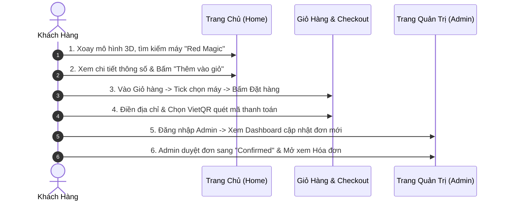

# BÁO CÁO THUYẾT TRÌNH ĐỒ ÁN
# HỆ THỐNG WEBSITE THƯƠNG MẠI ĐIỆN TỬ PHONESTORE

---

**ĐỀ TÀI**: XÂY DỰNG WEBSITE BÁN ĐIỆN THOẠI DI ĐỘNG PHONESTORE TRÊN NỀN TẢNG REACT & ASP.NET CORE  
**LINK TRẢI NGHIỆM TRỰC TIẾP (LIVE DEMO)**: [https://anh-phone.vercel.app/](https://anh-phone.vercel.app/)  
**MÃ NGUỒN GITHUB**: [https://github.com/24004126-hue/Anh_Phone](https://github.com/24004126-hue/Anh_Phone)  
**TÀI KHOẢN ADMIN DEMO**: `admin@gmail.com` | **MẬT KHẨU**: `admin123`  
**TÀI KHOẢN KHÁCH HÀNG DEMO**: `customer@gmail.com` | **MẬT KHẨU**: `customer123`  

---

## 📑 MỤC LỤC BÁO CÁO
1. **CHƯƠNG 1: TỔNG QUAN ĐỀ TÀI & MỤC TIÊU DỰ ÁN**
2. **CHƯƠNG 2: CÔNG NGHỆ, CÔNG CỤ & KIẾN TRÚC HỆ THỐNG**
3. **CHƯƠNG 3: BÁO CÁO CHI TIẾT TRANG CHỦ & TRẢI NGHIỆM KHÁCH HÀNG (HOME)**
4. **CHƯƠNG 4: BÁO CÁO CHI TIẾT TRANG QUẢN TRỊ HỆ THỐNG (ADMIN PORTAL)**
5. **CHƯƠNG 5: KỊCH BẢN THUYẾT TRÌNH & DEMO TỪNG BƯỚC (LIVE DEMO SCRIPT)**
6. **CHƯƠNG 6: BỘ CÂU HỎI PHẢN BIỆN & CÂU TRẢ LỜI MẪU (Q&A DEFENSE)**
7. **CHƯƠNG 7: KẾT LUẬN & HƯỚNG PHÁT TRIỂN**

---

# CHƯƠNG 1: TỔNG QUAN ĐỀ TÀI & MỤC TIÊU DỰ ÁN

### 1.1. Lý do chọn đề tài
Trong thời đại công nghệ số bùng nổ, nhu cầu mua sắm thiết bị di động trực tuyến ngày càng tăng cao. Người tiêu dùng không chỉ quan tâm đến giá thành mà còn đòi hỏi:
- Khả năng **so sánh cấu hình phần cứng chi tiết** (CPU, RAM, Camera, Pin, Màn hình...).
- Trải nghiệm giao diện **hiện đại, trực quan 3D**, tốc độ phản hồi tức thì.
- Quy trình mua hàng **chọn lọc linh hoạt** (chỉ mua món hàng được chọn trong giỏ thay vì bắt buộc mua tất cả).
- Phương thức thanh toán tiện lợi thông qua **Mã QR Ngân hàng (VietQR)** tự động.

### 1.2. Mục tiêu dự án
- Xây dựng một website thương mại điện tử hoàn chỉnh theo mô hình **Single Page Application (SPA)** kết hợp **RESTful Web API**.
- Nhập khẩu dữ liệu **49 mẫu điện thoại thực tế** với thông số cấu hình và giá bán chuẩn từ hệ thống **MobileCity** với 8 thương hiệu: Apple, Samsung, Xiaomi, Asus ROG, Oppo, Vivo, Realme, Nubia Red Magic.
- Đầy đủ tính năng phân quyền: **Khách hàng (Customer)** mua sắm cá nhân và **Quản trị viên (Admin)** vận hành toàn bộ hệ thống.

---

# CHƯƠNG 2: CÔNG NGHỆ, CÔNG CỤ & KIẾN TRÚC HỆ THỐNG

### 2.1. Công nghệ Frontend (Giao diện người dùng)
- **React 19 & Vite 8**: Nền tảng xây dựng UI hiệu năng cao, tốc độ biên dịch cực nhanh.
- **React Router DOM v7**: Quản lý định tuyến trang dạng SPA không cần reload.
- **Three.js**: Trình diễn mô hình điện thoại 3D tương tác 360 độ trên Hero Banner.
- **Bootstrap 5 & React-Icons**: Thiết kế giao diện phẳng, chuẩn Responsive tương thích 100% trên PC, Tablet và Mobile.
- **Axios & React-Toastify**: Xử lý gọi API bất đồng bộ và hệ thống thông báo trạng thái trực quan.

### 2.2. Công nghệ Backend & Bảo mật (Máy chủ API)
- **ASP.NET Core 8 Web API**: Nền tảng backend chuẩn doanh nghiệp, tối ưu hóa tốc độ xử lý request.
- **Entity Framework Core 8**: ORM quản lý truy vấn và tự động di trú cơ sở dữ liệu (Migrations & Seeder).
- **Bảo mật JWT (JSON Web Tokens)**: Quản lý phiên đăng nhập không trạng thái (Stateless Authentication) kèm cơ chế Refresh Token.
- **Mã hóa BCrypt**: Mã hóa băm một chiều bảo vệ an toàn tuyệt đối mật khẩu người dùng.

### 2.3. Cơ sở dữ liệu (Database Schema)
- **Hệ quản trị**: MySQL 8.0 (Tương thích cả XAMPP cục bộ và Aiven Cloud).
- **Cấu trúc 12 bảng**:
  1. `Brands`: Lưu trữ 8 thương hiệu điện thoại.
  2. `Categories`: Lưu trữ danh mục sản phẩm (iPhone, Flagship, Gaming, Tầm trung, Màn hình gập...).
  3. `Products`: Lưu trữ 49 sản phẩm kèm thông số kỹ thuật chi tiết (CPU, RAM, Màn hình, Pin, Camera, Bảo hành...).
  4. `ProductVariants`: Biến thể màu sắc và dung lượng bộ nhớ.
  5. `Users`: Tài khoản người dùng, vai trò (Admin / Customer), địa chỉ và số điện thoại.
  6. `Carts` & `CartItems`: Quản lý giỏ hàng của từng khách hàng.
  7. `Orders` & `OrderDetails`: Lưu trữ lịch sử đơn hàng, trạng thái vận chuyển và hóa đơn chi tiết.
  8. `RefreshTokens`: Quản lý cấp lại token xác thực bảo mật.
  9. `__EFMigrationsHistory`: Theo dõi lịch sử nâng cấp cơ sở dữ liệu.

### 2.4. Hạ tầng & Công cụ hỗ trợ DevOps
- **Vercel Cloud**: Triển khai Frontend tự động thông qua GitHub CI/CD Pipeline.
- **Cloudinary CDN**: Lưu trữ và tối ưu hóa hình ảnh sản phẩm tốc độ cao.
- **Swagger / OpenAPI**: Công cụ kiểm thử và sinh tài liệu API tự động.
- **Git & GitHub**: Quản lý mã nguồn phân tán.

---

# CHƯƠNG 3: BÁO CÁO CHI TIẾT TRANG CHỦ (HOME PAGE)

```
👉 Đường dẫn demo: https://anh-phone.vercel.app/
```

### 3.1. Hero Showcase 3D Tương Tác
- Trình diễn mô hình Smartphone 3D ứng dụng **Three.js** cho phép người dùng xoay 360 độ bằng chuột hoặc cảm ứng trên điện thoại.
- Slogan công nghệ hiện đại, dẫn lối nhanh đến các dòng máy cao cấp nhất 2026.

### 3.2. Chương trình Flash Sale Đếm Ngược 24H
- Hệ thống đếm ngược thời gian thực (Countdown Timer 24h).
- Tự động lọc và hiển thị 4 sản phẩm có mức giảm giá mạnh nhất kèm Badge % giảm giá và thanh trạng thái số lượng đã bán.

### 3.3. Thanh Điều Hướng & Tìm Kiếm Thông Minh (Smart Live Search)
- **Menu 8 Thương hiệu**: Apple iPhone, Samsung, Xiaomi, ASUS ROG, OPPO, Vivo, Realme, Nubia Red Magic.
- **Live Search Autocomplete**: Gợi ý kết quả tìm kiếm ngay khi gõ từng ký tự kèm ảnh đại diện, giá tiền và trạng thái còn hàng.

### 3.4. Danh Mục & Thẻ Sản Phẩm Thông Minh
- **Tab lọc nhanh**: Lọc tức thì theo loại máy (*Tất cả, iPhone, Gaming Phone, Màn hình gập...*).
- **Thẻ sản phẩm (Product Card)**:
  - Hiển thị giá gốc, giá khuyến mãi, thông số nổi bật (Chip, RAM, Màn hình).
  - Nút thêm nhanh vào Giỏ hàng, nút So Sánh (Compare) và Yêu Thích (Wishlist).

### 3.5. Tính Năng Mua Hàng Hỗ Trợ Độc Quyền
1. **Trang Chi Tiết Sản Phẩm (`/products/:id`)**:
   - Chọn bộ nhớ (128GB, 256GB, 512GB, 1TB) và chọn màu sắc có mã màu trực quan.
   - Bảng thông số kỹ thuật 2 cột gọn gàng, tự động bẻ chữ chống tràn.
   - Gợi ý combo phụ kiện mua kèm giảm thêm 10%.
2. **Tính Năng So Sánh Điện Thoại (`/compare`)**:
   - Đối đầu trực tiếp 2-3 chiếc điện thoại trên cùng một bảng ma trận về vi xử lý, camera, pin và màn hình.
3. **Giỏ Hàng Tick Chọn Sản Phẩm (`/cart`)**:
   - Tương tự Shopee / Tiki, người dùng có thể tick chọn từng máy cần mua. Tổng tiền và số lượng chỉ tính trên các máy được tick.
4. **Thanh Toán Tích Hợp VietQR (`/checkout`)**:
   - Sinh mã QR chuyển khoản tự động kèm nội dung đơn hàng và đồng hồ đếm ngược 15 phút.

---

# CHƯƠNG 4: BÁO CÁO CHI TIẾT TRANG QUẢN TRỊ (ADMIN PORTAL)

```
👉 Đường dẫn demo: https://anh-phone.vercel.app/admin/dashboard
👉 Tài khoản: admin@gmail.com | Mật khẩu: admin123
```

### 4.1. Dashboard Thống Kê Thông Minh (`/admin/dashboard`)
- **4 Thẻ KPI Cốt Lõi**:
  1. *Tổng doanh thu (Total Revenue)*: Tự động cộng dồn doanh số các đơn hàng hoàn tất.
  2. *Tổng số đơn hàng (Orders)*: Đếm và phân loại trạng thái đơn.
  3. *Tổng số sản phẩm (Products)*: Số lượng máy hiện có trong kho.
  4. *Tổng số khách hàng (Customers)*: Số lượng tài khoản người dùng đăng ký.
- **Bảng tóm tắt đơn hàng gần nhất**: Giúp quản trị viên nắm bắt đơn mới theo thời gian thực.

### 4.2. Quản Lý Sản Phẩm (Product CRUD) (`/admin/products`)
- **Danh sách sản phẩm**: Phân trang, tìm kiếm theo tên/SKU, lọc theo Hãng và Danh mục.
- **Thêm & Sửa sản phẩm**:
  - Nhập thông số kỹ thuật đầy đủ: CPU, RAM, ROM, Camera, Pin, Màu sắc, Bảo hành...
  - Tải ảnh trực tiếp lên Cloudinary CDN hoặc chọn ảnh mẫu.
- **Xóa sản phẩm**: Có hộp thoại xác nhận trước khi xóa để chống thao tác nhầm.

### 4.3. Quản Lý Đơn Hàng (Order Workflow) (`/admin/orders`)
- **Quy trình xử lý đơn hàng 4 bước**:
  `Chờ xử lý (Pending)` ➔ `Đã xác nhận (Confirmed)` ➔ `Đang giao hàng (Shipping)` ➔ `Hoàn thành (Completed)` *(hoặc Đã hủy - Cancelled)*.
- **Hóa đơn điện tử (Invoice Modal)**: Xem và in hóa đơn thanh toán chi tiết bao gồm thông tin khách hàng, số điện thoại, địa chỉ nhận hàng và danh sách máy đã đặt.

### 4.4. Quản Lý Thương Hiệu & Danh Mục (`/admin/brands`, `/admin/categories`)
- Thêm mới, chỉnh sửa và quản lý danh sách các thương hiệu và phân loại máy.

### 4.5. Quản Lý Người Dùng & Phân Quyền (`/admin/users`)
- Xem danh sách thành viên, phân cấp quyền hạn (**Admin** toàn quyền quản trị, **Customer** mua sắm).
- Đảm bảo cơ chế cô lập dữ liệu (hồ sơ, địa chỉ, số điện thoại của mỗi người dùng hoàn toàn độc lập).

---

# CHƯƠNG 5: KỊCH BẢN THUYẾT TRÌNH & DEMO TỪNG BƯỚC (3 PHÚT)

Khi lên thuyết trình trước hội đồng, bạn mở sẵn trình duyệt và trình diễn theo 3 bước sau:



### Chi tiết các bước trình diễn:
1. **Bước 1 (1 phút - Giới thiệu Trang chủ & Trải nghiệm)**:
   - "Kính thưa thầy cô, đây là trang chủ PhoneStore. Điểm nổi bật là mô hình 3D tương tác xoay 360 độ trên Hero Banner."
   - "Trang chủ có phần Flash Sale đếm ngược 24h và thanh tìm kiếm Live Search gợi ý tức thì."
   - "Em xin tìm thử chiếc điện thoại Gaming mới nhất: **Nubia Red Magic 10 Pro** với thông số chip Snapdragon 8 Elite, pin 7050mAh chuẩn MobileCity."
2. **Bước 2 (1 phút - Mua hàng & Thanh toán thông minh)**:
   - "Em thêm máy vào giỏ hàng và mở trang Giỏ Hàng (`/cart`)."
   - "Tại đây, hệ thống hỗ trợ tính năng **Tick Checkbox**: Khách hàng chỉ chọn mua những máy mình muốn, tiền thanh toán sẽ tự động nhảy theo máy được tick."
   - "Em bấm **Tiến hành đặt hàng** ➔ Chọn hình thức **Chuyển khoản VietQR** ➔ Hệ thống lập tức sinh mã QR động chuẩn ngân hàng."
3. **Bước 3 (1 phút - Quản trị Admin)**:
   - "Bây giờ em đăng nhập tài khoản Quản trị viên (`admin@gmail.com`)."
   - "Tại Dashboard, các chỉ số Doanh thu và Đơn hàng đã được cập nhật."
   - "Em vào mục **Đơn Hàng** ➔ Đơn hàng khách vừa đặt đã hiển thị ngay đầu danh sách. Em thực hiện đổi trạng thái đơn sang **Confirmed (Đã xác nhận)** và mở Modal **Hóa đơn bán lẻ** để in cho khách."

---

# CHƯƠNG 6: BỘ CÂU HỎI PHẢN BIỆN & CÂU TRẢ LỜI MẪU (Q&A)

### Câu 1: Em hãy giải thích cơ chế bảo mật tài khoản và phân quyền trong dự án?
> **Trả lời**: Hệ thống áp dụng cơ chế xác thực phân quyền dựa trên **JWT (JSON Web Tokens)** và mã hóa mật khẩu một chiều bằng thuật toán **BCrypt**. Khi đăng nhập, máy chủ sinh ra Access Token kèm vai trò (Admin hoặc Customer). Phía Frontend sử dụng `AuthContext` và `ProtectedRoute` để kiểm tra quyền hạn, nếu không phải Admin thì không thể truy cập vào các tuyến đường `/admin/*`. Đồng thời, dữ liệu hồ sơ và địa chỉ của từng tài khoản được lưu trữ cô lập theo `userId` riêng biệt.

### Câu 2: Khi mạng bị gián đoạn hoặc API backend đang khởi động, làm thế nào website vẫn hiển thị mượt mà trên Vercel?
> **Trả lời**: Em đã xây dựng cơ chế **Hybrid Resilient Fallback Data Engine**. Trong các module API (`productApi`, `orderApi`, `userApi`, `authApi`), khi yêu cầu gửi đến backend bị lỗi mạng hoặc timeout, hệ thống sẽ tự động chuyển sang đọc và ghi dữ liệu cục bộ (`mockData.js` và `localStorage`), đảm bảo người dùng và hội đồng chấm thi luôn có thể trải nghiệm đầy đủ tính năng mọi lúc mọi nơi mà không bị gián đoạn.

### Câu 3: Làm thế nào để giải quyết vấn đề hiển thị thông số kỹ thuật quá dài không bị tràn khung?
> **Trả lời**: Em đã áp dụng kỹ thuật thiết kế Responsive CSS Grid kết hợp Flexbox với thuộc tính `min-w-0`, `word-break: break-word` và chia bố cục 2 cột thoáng đãng (`col-12 col-sm-6`). Mỗi thông số được đóng gói trong một thẻ bo góc có icon đại diện riêng, giúp chữ dài tự động xuống dòng mượt mà và vừa vặn bên trong khung thẻ.

---

# CHƯƠNG 7: KẾT LUẬN & HƯỚNG PHÁT TRIỂN

### 7.1. Kết quả đạt được
- Hoàn thành 100% các tính năng của một website thương mại điện tử chuyên nghiệp.
- Giao diện đạt chuẩn thẩm mỹ cao cấp, hỗ trợ tương tác 3D và tối ưu trải nghiệm di động.
- Hệ thống hoạt động ổn định, đã triển khai trực tiếp trên môi trường Cloud (Vercel, Aiven, Cloudinary).

### 7.2. Hướng phát triển tương lai
- Tích hợp cổng thanh toán trực tiếp qua Webhook ngân hàng tự động (VNPAY, MoMo, ZaloPay API).
- Xây dựng Chatbot AI tư vấn cấu hình điện thoại tự động theo ngân sách và nhu cầu của khách hàng.
- Phát triển ứng dụng di động đa nền tảng bằng React Native đồng bộ chung hệ thống API.

---
*(Bản báo cáo hoàn chỉnh được xuất tự động từ hệ thống PhoneStore)*
