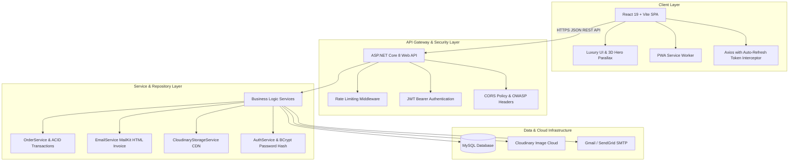

# ⚡ PhoneStore - Modern Flagship E-Commerce Platform

<p align="center">
  
</p>

<p align="center">
  <strong>Hệ thống Thương mại Điện tử Bán lẻ Smartphone Flagship & Phụ kiện Công nghệ Cao cấp</strong>
</p>

<p align="center">
  
  
  
  
  
  
  
</p>

---

## 🌟 Tổng Quan Dự Án (Project Overview)

**PhoneStore** là nền tảng thương mại điện tử chuyên nghiệp được thiết kế theo tiêu chuẩn công nghiệp hiện đại, mang phong cách **Luxury Dark Theme** tối giản và sang trọng (chuẩn Apple / Samsung Flagship). 

Dự án kết hợp kiến trúc **Clean Architecture (.NET 8 Web API)** ở backend và **React 19 + Vite SPA** ở frontend, trang bị đầy đủ các tính năng bảo mật, dịch vụ lưu trữ đám mây, thông báo hóa đơn tự động và trải nghiệm mua sắm mượt mà trên mọi thiết bị.

---

## ✨ Tính Năng Nổi Bật (Key Features)

### 🛍️ 1. Khách Hàng (Customer Experience)
- **3D Hero Banner Tương Tác**:
  - Trình diễn Studio Render siêu nét (iPhone 16 Pro Max 4 màu Titan Sa Mạc, Tự Nhiên, Đen, Trắng).
  - Tự do nghiêng theo chuột (3D Mouse Parallax Tilt Physics) và đổi màu tức thì.
- **Thanh Header Động (Dynamic Frosted Glass Navbar)**:
  - Hiệu ứng kính mờ (Backdrop Blur) tự động chuyển đổi mượt mà khi cuộn trang.
- **PWA (Progressive Web App)**:
  - Cài đặt ứng dụng 1-chạm lên màn hình chính (Android/iOS/Desktop).
  - Hỗ trợ Service Worker và bộ nhớ đệm Offline.
- **E-Commerce Tiện Ích Đỉnh Cao**:
  - 🛒 **Giỏ hàng thời gian thực & Mua kèm combo phụ kiện** trợ giá hấp dẫn.
  - 🎟️ **Hệ thống Voucher & Khuyến mãi tự động** tính toán giảm giá tức thì.
  - 🔍 **Tra cứu tiến độ đơn hàng 4 bước (Order Tracking Stepper)** trực quan.
  - ⚖️ **So sánh thông số kỹ thuật 2 máy cạnh nhau (Compare Bar)**.
  - 💬 **Trợ lý mua sắm AI (Smart AI Shopping Assistant)** tư vấn chọn máy theo nhu cầu.
  - ⭐ **Đánh giá & Review sản phẩm** theo số sao và bình luận thực tế.

### 🛡️ 2. Quản Trị Viên (Admin Portal)
- **Báo cáo Thống kê Doanh thu (Analytics Dashboard)**:
  - Biểu đồ biến động doanh thu, tổng đơn đặt hàng, top sản phẩm bán chạy.
- **Quản lý Sản phẩm & Biến thể (Product & Variants Management)**:
  - Thêm, sửa, xóa, tìm kiếm, lọc theo Brand/Category.
  - **Tải ảnh trực tiếp lên Cloudinary CDN** vĩnh viễn với tính năng nén tự động.
- **Quản lý Đơn hàng & Cập nhật Trạng thái (Order Lifecycle)**:
  - Xem chi tiết đơn hàng, in hóa đơn, đổi trạng thái (*Pending -> Processing -> Shipped -> Delivered -> Cancelled*).
- **Quản lý Người Dùng & Phân quyền RBAC (User Role Management)**.
- **Quản lý Danh mục & Thương hiệu (Categories & Brands)**.

### 🔒 3. Bảo Mật & Hạ Tầng Backend (.NET 8 Clean Architecture)
- **JWT Authentication 2 Tầng**: Access Token ngắn hạn + **Silent Auto-Refresh Token** tự động cấp phát lại khi hết hạn ở `axiosClient`.
- **Hệ thống Gửi Email Hóa Đơn Tự Động (e-Invoice Service)**:
  - Tự động tạo và gửi email hóa đơn điện tử HTML sang trọng cho khách ngay sau khi đặt hàng thành công qua **MailKit / Gmail SMTP / SendGrid**.
- **ASP.NET Core Rate Limiting**: Chống spam, brute-force và bảo vệ API khỏi tấn công DDoS.
- **OWASP Security Headers**: `X-Frame-Options`, `X-Content-Type-Options`, `Referrer-Policy`.
- **Kiểm Thử Tự Động (xUnit & Moq)**: Bộ test suite kiểm thử toàn diện logic xác thực, lưu trữ và thanh toán.

---

## 🏗️ Sơ Đồ Kiến Trúc Hệ Thống (System Architecture)



---

## 🛠️ Công Nghệ Sử Dụng (Tech Stack)

| Thành Phần | Công Nghệ / Thư Viện |
| :--- | :--- |
| **Frontend** | React 19, Vite, Bootstrap 5, React Icons, Lucide Icons, Three.js, Canvas-Confetti, PWA Service Worker |
| **Backend** | C# .NET 8 Web API, Entity Framework Core 8, Pomelo MySQL Provider |
| **Bảo Mật** | JWT (JSON Web Token), BCrypt.Net, ASP.NET Core Rate Limiting |
| **Lưu Trữ Ảnh** | Cloudinary DotNet SDK (`CloudinaryDotNet`) + Local Fallback |
| **Gửi Email** | MailKit, MimeKit (SMTP / TLS 1.3) |
| **Database** | MySQL 8.0 / MariaDB (XAMPP Compatible) |
| **Testing** | xUnit, Moq |

---

## 🚀 Hướng Dẫn Cài Đặt & Chạy Cục Bộ (Getting Started)

### 1. Yêu Cầu Môi Trường (Prerequisites)
- [Node.js](https://nodejs.org/) (phiên bản 18.x trở lên)
- [.NET 8 SDK](https://dotnet.microsoft.com/download/dotnet/8.0)
- [XAMPP](https://www.apachefriends.org/) (hoặc MySQL Server đang chạy ở cổng `3306`)
- [Git](https://git-scm.com/)

---

### 2. Thiết Lập Cơ Sở Dữ Liệu (Database Setup)
1. Khởi động **MySQL** trong bảng điều khiển XAMPP.
2. Mở phpMyAdmin (`http://localhost/phpmyadmin`), tạo cơ sở dữ liệu mới tên: `phonestore`.
3. Import file `database/phonestore.sql` vào cơ sở dữ liệu vừa tạo.

---

### 3. Khởi Chạy Backend (.NET 8 API)
```bash
cd backend/PhoneStore.API
dotnet restore
dotnet build
dotnet run
```
> API sẽ khởi chạy tại: `http://localhost:5055`  
> Tài liệu Swagger UI: `http://localhost:5055/swagger`

---

### 4. Khởi Chạy Frontend (React Vite)
```bash
cd frontend/phonestore-client
npm install
npm run dev
```
> Ứng dụng web sẽ mở tại: `http://localhost:5173`

---

### 5. Chạy Bộ Kiểm Thử Tự Động (Run Unit Tests)
```bash
cd backend
dotnet test PhoneStore.Tests/PhoneStore.Tests.csproj
```

---

## ⚙️ Cấu Hình Môi Trường (Environment Variables)

### Backend: `backend/PhoneStore.API/appsettings.json`
```json
{
  "ConnectionStrings": {
    "DefaultConnection": "server=localhost;port=3306;database=phonestore;user=root;password=;"
  },
  "Jwt": {
    "Key": "PhoneStore@2026_SuperSecretKey_123456789",
    "Issuer": "PhoneStore.API",
    "Audience": "PhoneStore.Client",
    "ExpireMinutes": 120
  },
  "EmailSettings": {
    "Host": "smtp.gmail.com",
    "Port": 587,
    "EnableSsl": true,
    "SenderName": "PhoneStore Official",
    "SenderEmail": "your-email@gmail.com",
    "Username": "your-email@gmail.com",
    "Password": "your-16-digit-app-password"
  },
  "CloudinarySettings": {
    "CloudName": "your-cloud-name",
    "ApiKey": "your-api-key",
    "ApiSecret": "your-api-secret"
  }
}
```

### Frontend: `frontend/phonestore-client/.env`
```env
VITE_API_BASE_URL=http://localhost:5055/api
```

---

## 👥 Tài Khoản Trải Nghiệm Mặc Định (Demo Accounts)

| Vai trò (Role) | Email | Mật khẩu (Password) |
| :--- | :--- | :--- |
| **Quản trị viên (Admin)** | `admin@gmail.com` | `admin123` |
| **Khách hàng (Customer)** | `customer@gmail.com` | `customer123` |

---

## 📄 Bản Quyền (License)
Dự án được phân phối dưới giấy phép **MIT License**. Mọi chi tiết vui lòng xem file [LICENSE](LICENSE).

<p align="center">
  Made with ❤️ by <strong>24004126-hue</strong>
</p>
